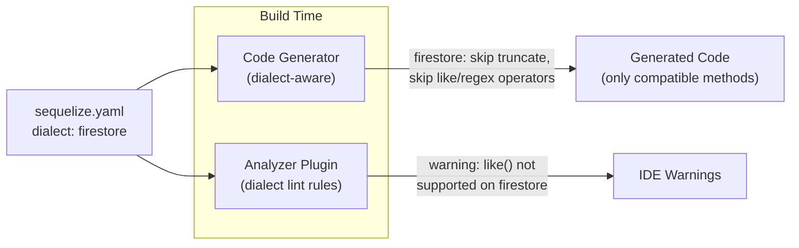
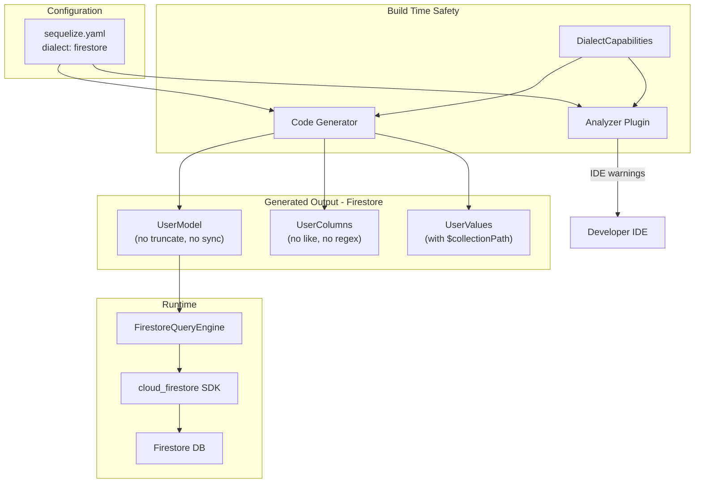

# Firestore Support for sequelize_orm

## Core Idea: Dialect-Aware Generation + Static Analysis

Instead of generating all methods and throwing runtime errors for unsupported Firestore features, the system uses **compile-time safety**:

1. `sequelize.yaml` declares the target `dialect` (postgres, mysql, firestore, etc.)
2. The **code generator** reads the dialect and only emits methods/operators that are compatible
3. The **analyzer plugin** lints against incompatible usage and gives IDE warnings/errors




## Step 1: Dialect Configuration

### 1a. sequelize.yaml

Add `dialect` as a top-level field (already partially exists under `connection.dev.dialect`). Promote it to top-level so both the generator and analyzer can read it:

```yaml
# sequelize.yaml
dialect: firestore        # or: postgres, mysql, mariadb, sqlite, mssql

models_path: lib/db/models
seeders_path: lib/db/seeders

# SQL dialects still use connection block
connection:
  default:
    url: postgres://...

# Firestore has no connection block (uses Firebase SDK init)
```

### 1b. GeneratorNamingConfig

Extend [packages/sequelize_orm_generator/lib/src/generator_naming_config.dart](packages/sequelize_orm_generator/lib/src/generator_naming_config.dart) to include the dialect:

```dart
class GeneratorNamingConfig {
  final String dialect;  // 'postgres', 'mysql', 'firestore', etc.
  // ... existing fields ...

  bool get isFirestore => dialect == 'firestore';
  bool get isSql => !isFirestore;
}
```

The generator already reads `BuilderOptions` via `GeneratorNamingConfig.fromOptions()`. The dialect can be passed through `build.yaml` options or read from `sequelize.yaml` at build time.

## Step 2: Dialect Compatibility Map

Define a central compatibility map that both the generator and analyzer reference:

```dart
class DialectCapabilities {
  final bool supportsLike;
  final bool supportsRegex;
  final bool supportsJoin;
  final bool supportsTruncate;
  final bool supportsSync;
  final bool supportsGroup;
  final bool supportsBetween;       // auto-decompose to gte+lte for firestore
  final bool supportsColComparison;
  final bool supportsILike;         // postgres-only
  final bool supportsMatch;         // postgres-only
  final bool supportsCollectionGroup; // firestore-only
  final bool supportsSubCollections;  // firestore-only
  final int maxWhereInValues;       // 30 for firestore, unlimited for SQL
  final int maxOrClauses;           // 30 for firestore, unlimited for SQL
}
```

Predefined instances:

- `DialectCapabilities.postgres` -- full SQL support + iLike, match, regex
- `DialectCapabilities.mysql` -- full SQL support + regex, no iLike
- `DialectCapabilities.firestore` -- eq/ne/gt/gte/lt/lte/in/notIn/isNull/or/and only, plus sub-collections

## Step 3: Dialect-Aware Code Generator

### 3a. Conditional Method Generation

In [packages/sequelize_orm_generator/lib/src/sequelize_model_generator.dart](packages/sequelize_orm_generator/lib/src/sequelize_model_generator.dart), the generator already conditionally generates classes (e.g., `namingConfig.generateCreateClass`). Extend this pattern for dialect:

**Methods skipped for Firestore:**

- `truncate()` -- no Firestore equivalent
- `sync()` -- Firestore is schemaless
- `restore()` -- generated only if paranoid is true AND dialect supports it (SQL only, unless Firestore paranoid is implemented via deletedAt field logic in the engine)

**Methods modified for Firestore:**

- `increment()`/`decrement()` -- generated but uses `FieldValue.increment()` semantics
- `max()`/`min()`/`sum()` -- generated, uses Firestore aggregation queries

### 3b. Conditional Operator Generation on Column Extensions

The generated `*Columns` class produces typed column references with operator extension methods. For Firestore dialect, the generator **skips emitting** these extension methods:

**SQL-only operators (not generated for Firestore):**

- `like()`, `notLike()`, `iLike()`, `notILike()`
- `startsWith()`, `endsWith()`, `substring()` (Firestore has no LIKE)
- `regexp()`, `notRegexp()`, `iRegexp()`, `notIRegexp()`
- `col()` (cross-column comparison)
- `match()` (full-text search)
- `all()`, `any()` (SQL sub-query operators)

**Firestore-compatible operators (always generated):**

- `eq()`, `ne()`, `gt()`, `gte()`, `lt()`, `lte()`
- `in_()`, `notIn()`
- `isNull()`, `isNotNull()`
- `between()` (auto-decomposed to gte+lte by the engine)

**Result:** If dialect is `firestore`, calling `.like()` on a column is a **compile error** because the method doesn't exist. No runtime surprise.

### 3c. Firestore-Specific Generation

When dialect is `firestore`:

- Generate `$collectionPath` getter on each model
- Generate `$parentModel` reference from `@Table(parent: X)`
- Generate document ID field handling (Firestore uses string document IDs, not auto-increment int)

## Step 4: Analyzer Lint Rules

Extend the existing analyzer plugin at [packages/sequelize_orm_analyzer/lib/main.dart](packages/sequelize_orm_analyzer/lib/main.dart) with dialect-aware rules.

### 4a. Read Dialect in Analyzer

The analyzer plugin reads `sequelize.yaml` from the project root to determine the active dialect. This is done once at plugin initialization.

### 4b. New Lint Rules

`**incompatible_operator_for_dialect**`

- Flags usage of operators not supported by the configured dialect
- Example: Using `.like()` when dialect is `firestore` shows a warning
- This catches cases where a developer imports raw operator functions (not going through generated columns)

`**firestore_where_in_limit**`

- Flags `.in_()` calls with more than 30 literal values
- Firestore hard limit

`**firestore_or_clause_limit**`

- Flags `or()` with more than 30 disjunctions

`**firestore_missing_parent_context**`

- Warns when querying a model with `parent` set but no parent ID provided in the where clause

`**firestore_order_index_hint**`

- Info-level hint when `order` is used with `where` on different fields (requires composite Firestore index)

### 4c. Quick Fixes

- `incompatible_operator_for_dialect` -> Suggest removing the operator call or switching to a compatible alternative
- `firestore_where_in_limit` -> Suggest splitting into multiple queries

## Step 5: Firestore Query Engine Package

(Same as previous plan, summarized)

### Package: `sequelize_orm_firebase`

- **FirestoreConnection** -- wraps `FirebaseFirestore` instance
- **CollectionPathResolver** -- resolves model hierarchy to Firestore paths using `@Table(parent: X)`
- **Operator Translator** -- JSON operators to Firestore `.where()` chains

  | JSON Operator       | Firestore Method                     |
  | ------------------- | ------------------------------------ |
  | `$eq`               | `.where(field, isEqualTo: value)`    |
  | `$ne`               | `.where(field, isNotEqualTo: value)` |
  | `$gt/$gte/$lt/$lte` | corresponding Firestore comparisons  |
  | `$in` / `$notIn`    | `whereIn` / `whereNotIn`             |
  | `$is: null`         | `isNull: true`                       |
  | `$and`              | chained `.where()` calls             |
  | `$or`               | `Filter.or(...)`                     |

- **FirestoreQueryEngine** -- implements `QueryEngineInterface`

  | Method                | Firestore Implementation                       |
  | --------------------- | ---------------------------------------------- |
  | `findAll`             | `collection.where(...).get()`                  |
  | `findOne`             | `collection.where(...).limit(1).get()`         |
  | `create`              | `collection.add(data)` or `doc(id).set(data)`  |
  | `update`              | `doc(id).update(data)` or batch update         |
  | `destroy`             | `doc(id).delete()` or batch delete             |
  | `count`               | `collection.count().get()`                     |
  | `increment/decrement` | `doc.update({field: FieldValue.increment(n)})` |
  | `max/min/sum`         | `collection.aggregate(...)`                    |

- **Associations** -- `include` translates to sequential sub-collection reads; root-collection associations use field-based where filters

## Step 6: Core Package Changes (sequelize_orm)

Minimal additions:

- `**@Table**` -- Add optional `parent` field (`Type?`) for sub-collection hierarchy
- `**Query**` -- Add optional `collectionGroup` bool
- `**DialectCapabilities**` -- Add the capabilities class (shared by generator + analyzer)

## Architecture Diagram




## Summary of Changes Per Package

- **sequelize_orm** -- Add `parent` to `@Table`, `collectionGroup` to `Query`, add `DialectCapabilities` class
- **sequelize_orm_generator** -- Read dialect from config, conditionally generate methods/operators based on `DialectCapabilities`, generate Firestore path metadata when dialect is firestore
- **sequelize_orm_analyzer** -- Read dialect from `sequelize.yaml`, add lint rules for incompatible operators/methods, add Firestore-specific rules (whereIn limit, or limit, index hints)
- **sequelize_orm_firebase** (new) -- FirestoreQueryEngine, operator translator, path resolver, connection class

